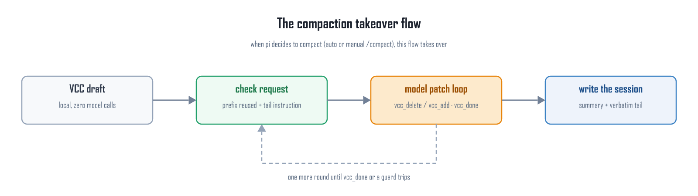
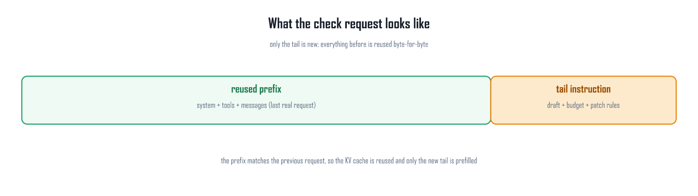
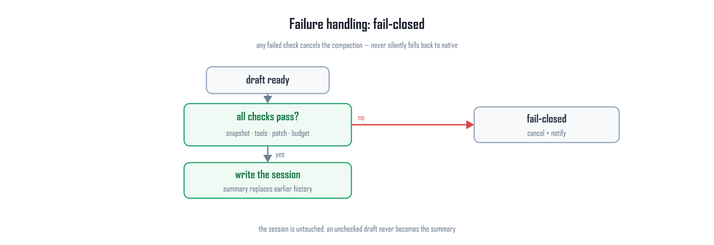

# pi-vcc-plus

> Replaces pi's context compaction — "one more summarization request" — with a
> **VCC mechanical draft + in-place model patching**: the prefix is not changed
> by a single byte, no separate summarization request is sent, and the KV
> prefix cache is reused.
>
> [中文](README.md)

## Why it exists

pi's native compaction is a **separate summarization request**: it swaps the
system prompt, rearranges the body, and drops the tools — token 0 already
differs, the entire prefix KV cache built by the previous request is invalid,
and the whole prefix must be prefilled again (the longer the session, the more
expensive).

pi-vcc-plus produces the summary a different way:

1. **The draft is generated by an algorithm** — upstream [pi-vcc](https://github.com/sting8k/pi-vcc)
   mechanical extraction: deterministic, zero model calls, milliseconds;
2. **The model adds one supplement pass** — a single instruction is appended to the end of
   the current session, and the model sends everything the draft is missing with
   `vcc_delete` (by line number) / `vcc_add` (by section name). That one response is applied
   as-is and ends the phase (`vcc_done` is optional; an edit-less response is re-asked once,
   and a response cut off at the completion cap still applies the calls that parsed) — the
   model sees the sections region as a numbered view (`NNN | line`), the transcript is
   unnumbered and read-only, and every call returns a full diff of
   what it removed, line numbers included;
3. **The prefix is untouched, byte for byte** — the check request = the previous
   real request verbatim (system + tools + messages) + the tail instruction, so
   the prefix is byte-identical and the server-side KV cache must be reused.

Cost: the one prefill that rebuilds the context after compaction is still
unavoidable (a cost shared by every compaction scheme).

## Relationship to upstream pi-vcc

This extension is built on top of
[@sting8k/pi-vcc](https://www.npmjs.com/package/@sting8k/pi-vcc) (MIT, pinned to
v0.8.0, git submodule `third_party/pi-vcc` @ `303e89d`):

| | pi-vcc (upstream) | pi-vcc-plus (this extension) |
|---|---|---|
| Draft generation | Mechanical extraction algorithm (structure, budget anchor, calibration) | Reuses upstream — never copied or modified (reads its source directly) |
| Model involvement | None (pure algorithm) | One supplement pass: `vcc_delete` / `vcc_add` (`vcc_draft` when needed, `vcc_done` optional) |
| Prefix stability | Not handled | Snapshot reuse + byte-level re-verification + fail-closed |
| History recall | `vcc_recall` (reads raw JSONL) | Registered by default (can be disabled) |

The loader reads only upstream's **published source** and changes nothing in
it. Updating upstream:

```powershell
git submodule update --remote --merge third_party/pi-vcc
git add third_party/pi-vcc
git commit -m "bump pi-vcc"
```

(`scripts/setup-upstream-vcc.ps1` is only for redoing that one-time switch —
replacing the in-repo local copy with the submodule.)

> If you also install pi-vcc itself (`pi install npm:@sting8k/pi-vcc`), set it
> to **installed but not loaded** in `~/.pi/agent/settings.json`:
> `{ "source": "npm:@sting8k/pi-vcc", "extensions": [] }`.
> Otherwise its own `session_before_compact` hook will compete with this
> extension for the same compaction.

## How it works

### The compaction takeover flow



The trigger reuses pi's native ones: automatic when the context is about to
fill, or manual `/compact` (pi's own abort semantics are kept). Takeover
happens on the `session_before_compact` event — after receiving the
`preparation` pi already computed (cut point, span to summarize, budget):

1. **VCC mechanical draft** — runs upstream pi-vcc locally to produce the
   structured draft (zero model calls);
2. **Build the check request** — the snapshot of the last provider request
   (system + tools + messages verbatim) + the tail instruction (draft,
   budget, patch rules);
3. **One supplement pass** — the model adds what the draft is missing in the
   "compaction check phase" using the closed tools: `vcc_delete` removes lines by
   **number** (the sections region is a numbered view for the model, the transcript
   is unnumbered and read-only), `vcc_add` appends lines to the end of a named
   **section** (`replace:true` clears that section first, i.e. rewrites it), and every
   call returns a **full diff** of what it removed. That single response is applied as-is
   and ends the phase;
4. **Finalize and write the session** — a mechanical pass first drops the
   draft's trailing transcript, the `---` separators and the `vcc_recall` note
   (see below); the finalized summary is then returned to pi, which writes the
   `CompactionEntry`; the kept tail enters the next window verbatim.

### What the check request looks like



- **messages**: the `context` event fires before every provider request; the
  snapshot stores the agent-format messages the model actually saw (with the
  same substitution as pi's `convertToLlmWithBlockImages` when
  `images.blockImages` is enabled);
- **the last reply**: before the tail instruction the check request appends
  one more assistant message — the last reply the session gained after the
  snapshot. The server generated that reply moments ago and still holds its
  KV, so appending it makes the check request a **strict continuation** of
  the last request (exactly the relationship normal turns have with each
  other) and the server agrees to reuse the prefix. Without it the token
  stream diverges from the sequence stored in the slot right at the snapshot
  boundary;
- **tools**: taken only from the `before_provider_request` payload (the last
  request's own wire tools, including order); the check request goes out
  through a custom fetch, and the outgoing body's `tools` are replaced with
  this **original wire tools** — structurally byte-identical (pi-ai's own
  reconstruction never reaches the wire);
- **request-level parameters**: the same custom fetch writes the last
  request's request-level parameters back onto the outgoing body
  (`chat_template_kwargs`, `max_tokens`, `store`, sampling, ...). Two reasons:
  (1) `chat_template_kwargs` feeds **server-side template rendering** — flip
  `enable_thinking` (true on agent turns, false by default on the
  `complete()` check call) and the rendered token sequence changes, so a
  byte-identical message prefix still misses; (2) some servers (measured:
  FastLLM) also key the prefix cache on `max_tokens`. `model` / `messages` /
  `tools` are owned by the extension and never overwritten;
- **Byte-level re-verification**: on round 1 the outgoing body is
  prefix-compared against the last real request's wire body (system / tools /
  messages); the result goes to the `checkPrefix` log (`identical` +
  `firstDivergence`) and the full body to
  `.pi/prefix-sentinel/check-request.json`. The baseline must be fresh
  (`ts >= snapshot time`), so stale leftovers from other processes/sessions
  cannot cause false alarms;
- **Framework-level assertion**: `round.cacheRead ≈ prefix length`
  (`prefixSuspect` must be false) — a second line of defense on the same
  invariant. Note the hit is **block-aligned** (vLLM 16 tokens / FastLLM 2048
  tokens); the remainder below one block is prefilled anyway.

### The final summary's shape (mechanical strip)

Upstream VCC's draft is written for a human reader: `[Section]` blocks +
`---` + a **transcript of the replaced turns** (`[user]` / `[assistant]` /
`* tool "..." (#123)`) + `---` + the `vcc_recall` note. Its `mergePrevious`
(`preserveFreshBriefOnMerge`) also merges the previous draft's transcript into
the new one, so the transcript accumulates across compactions. Left in place,
every new window opens with "summary + what looks like the last turns appended",
carrying `[user]`/`[assistant]` markers and `(#123)` indices — and pi's kept
turns follow right after, so it reads as duplicated content.

So the summary is finalized mechanically (`src/finalize.ts`, **no model
cooperation required**):

- drop every transcript block, `---` separator line, `vcc_recall` note and
  `...(N earlier lines omitted)` marker; the prompt therefore no longer asks
  the model to delete the transcript line by line (7 KB of raw text output
  spent for nothing, and failures whenever a quoted line matched more than
  once or not at all) — it only
  says the transcript is stripped automatically and is source material; the
  budget cap is measured on the finalized text too, so a transcript cannot push
  a draft over the budget;
- normalize the sections to the fixed set of eight, in a fixed order:
  `[Session Goal]`, `[Files And Changes]`, `[Commits]`, `[Key Decisions]`,
  `[Environment]`, `[Results]`, `[Outstanding Context]`, `[User Preferences]`;
  aliases (`[Outstanding]`) are renamed and invented headers
  (`[Root Cause: ...]`) are folded into the best-matching section by keyword —
  no content is dropped;
- only transcript/separator/note lines are ever removed: **section bullets are
  never dropped**; exact duplicate lines inside one section are deduped;
- if nothing section-shaped survives, the text is returned **unchanged** rather
  than as an empty summary;
- every strip logs a `finalize` line: `strippedTranscriptLines` /
  `strippedSeparators` / `strippedNotes` / `renamed` / `folded` /
  `charsBefore`->`charsAfter`.

Measured on this repo's session `01a0ca67`: 15798 -> 8670 chars, 97 transcript
lines, 3 `---` lines, 2 notes and 1 omitted marker removed;
`[Outstanding]` -> `[Outstanding Context]` and
`[Root Cause: double prefill]` folded into `[Results]`.

### Failure handling



| Trigger | Example |
|---|---|
| Missing snapshot | Brand-new session with no provider request yet (after `/reload` a persisted snapshot is restored first; only brand-new sessions need one normal message first) |
| tools unavailable / mismatched | No wire tools available; wire tools contain grammar/custom, `strict: true`, or `defer_loading` |
| Patch validation failed | line number out of range / pointing at a header or the transcript / deleted twice; append over budget; consecutive failures exceeded |
| Model error | API error, abort, plain-text finish with `requireDone`, round / draft-read limits |

Default policy `onFailure: auto`: manual `/compact` → throw; automatic
compaction → cancel + notify. `fallbackToNative: false` — **never silently
falls back to the native summarizer**: a silent fallback would defeat the
core "prefix reuse" goal and the user would never notice.

## Install

```powershell
# 0) Install dependencies (the recall tool in the submodule imports typebox,
#    resolved from the repo root)
npm install        # lockfile committed; bun install works too (tests run under bun)

# 1) Install the extension itself (local paths are not copied; /reload picks
#    up code changes)
git clone https://github.com/113636xfh/pi-vcc-plus.git
pi install ./pi-vcc-plus

# 2) Let pi load VCC: pick one of three routes (below)
```

`src/vcc.ts` resolves upstream pi-vcc in this order (always its **published
source**; we never modify it):

1. `config.vccPackagePath` (explicit)
2. environment variable `PI_VCC_PLUS_VCC_PATH`
3. **in-repo** `third_party/pi-vcc` (recommended: git submodule)
4. `~/.pi/agent/npm/node_modules/@sting8k/pi-vcc` (where
   `pi install npm:@sting8k/pi-vcc` puts it)
5. `<cwd>/.pi/npm/node_modules/@sting8k/pi-vcc`

## Configuration

`~/.pi/agent/vcc-plus/config.json` (created on first run):

```json
{
  "enabled": true,
  "vccPackagePath": null,
  "checkModel": null,
  "draftBudget": { "floorTokens": 1100, "ceilingTokens": 2000, "tokensPerBlock": 15 },
  "guards": { "maxRounds": 8, "maxConsecutiveFails": 4, "maxDraftReads": 3, "callTimeoutMs": 0, "requireDone": false },
  "onFailure": "auto",
  "fallbackToNative": false,
  "upstreamRecallTool": true,
  "alignCheckParams": true,
  "onContextOverflow": "trim",
  "debugLog": true,
  "systemBlock": "<pi-vcc-plus>…</pi-vcc-plus>"
}
```

- `checkModel: null` = the check request follows the session's current model;
- `guards` are all **counts**: slow models are not cut off by time
  (`callTimeoutMs` defaults to 0 = unlimited); `maxRounds: 1` is the one
  supplement pass (the response that carries the additions is the whole pass);
  set it above 1 to restore the older "patch until `vcc_done`" shape;
  `emptyRetries: 1` re-asks once when a round carries no tool calls at all
  (otherwise the untouched mechanical draft would be finalized); with
  `requireDone: true` the model must call `vcc_done` explicitly (a plain-text
  finish becomes a failure);
- `onFailure`: `auto` (manual throws / auto cancels + notifies), `cancel`,
  `throw`, `draft` (explicitly fall back to the unchecked draft);
- `fallbackToNative: false` = no silent fallback to pi's native summarizer on
  failure;
- `upstreamRecallTool: true` = registers the read-only `vcc_recall` that ships
  with upstream pi-vcc (rejected during the check phase);
- `alignCheckParams: true` = the check request re-sends the last real
  request's request-level parameters (`chat_template_kwargs`, `max_tokens`, ...)
  so both the rendering and the cache key match it. **Needed** where the
  template re-renders the prefix when those parameters change (measured:
  FastLLM's GGUF template — flipping `enable_thinking` changed the same
  history by 36 tokens → `cached_tokens=0`) or where the provider keys its
  cache on them (measured: FastLLM — identical tokens, different `max_tokens`
  → `cached_tokens=0`). **Cost**: check rounds inherit the session's thinking
  setting (measured: one round emitted 4441 output tokens in 2m05s). Turn it
  off for providers whose cache key is the prompt tokens alone (measured:
  vLLM + LMCache — flipping `enable_thinking` only moves the tail by 2 tokens
  and the hit stayed); check rounds then skip thinking and run much faster.
  Re-verify with `round.prefixSuspect` or `node scripts/log-rounds.mjs`;
- `onContextOverflow: "trim"` = what to do when the check request exceeds
  the provider's context window. **Why that happens**: pi 0.87 estimates context
  tokens as `chars/4` (`dist/core/compaction/compaction.js`), while Chinese-heavy
  content really needs ~**2.2 chars/token** — measured on one session: pi
  estimated **178,397**, the provider counted **322,385** (**1.81x**), so pi
  compacted too late and the provider rejected the real request first (llama.cpp:
  `request (322385 tokens) exceeds the available context size (262144 tokens)`).
  `trim` (default) = derive the true chars/token from the provider's own numbers,
  keep the newest slice that fits (the older part is what the draft already
  summarizes) and retry once; if that overflows too, finalize with the
  **mechanical draft** (the alternative is a session that can no longer compact);
  `draft` = skip the retry and use the draft right away (fastest, handy when the
  provider is slow or down); `fail` = no special handling, follow `onFailure`
  (fail closed). Note the premise: when the context itself is over the window the
  previous request was already rejected, so there is no cached prefix to reuse
  and "one prefill only" cannot apply; both degradations log
  (`check_trimmed` / `overflow_fallback`) and warn in the UI, never silently;
- the config is read once when the extension loads; change `config.json` with
  `/reload` (changing it mid-session would change the system block and break
  the prefix invariant);
- draft chars/token calibration follows upstream `before-compact.ts`'s anchor
  (span chars + previous summary chars ÷ `tokensBefore`) — an upstream
  algorithm behavior (conservative), intentionally kept identical rather than
  forked.

## Compared with native compaction (measured)

Setup: llama.cpp served from **2x Tesla V100-SXM2-16GB** (tensor parallel; model Qwen3.8-27B-GSQ-RCO-IQ3_S-mtp,
`-c 350208 --parallel 2 --kv-unified`, q8_0 KV, MTP draft n=3). The sample is a **real coding session** (~180K tokens of live context,
including 48 messages with tool calls); both implementations run the same copy of it, serially,
with an idle server.

| One compaction (~180K context) | pi native | **pi-vcc-plus** |
|---|---|---|
| compaction time | 508 s | **196 s (2.6x faster)** |
| of which prefill | 112,166 tokens -> 244.0 s | **3,584 tokens -> 15.9 s** (`cacheRead` hits 184,940, i.e. 98% of the context) |
| of which generation | 8,836 tokens -> 181.8 s | 6,494 tokens -> 178.9 s |
| summary size | 30,886 chars | 9,774 chars |
| loading the new context after compaction | 44.3 s | 28.4 s |

Native's summarization request swaps the system prompt, rearranges the body and drops the tools - 
token 0 already differs, so the **entire prefix is invalid** and it re-prefills **112,166 tokens**
every time. The plugin's check request is a strict continuation of the last request, so the prefix
is byte-identical and the server reuses it, prefilling only the draft and the tail instruction.
Generation is a wash (in a real session the mechanical draft is already complete, so the model
only adds a little - which is the other half of where the time goes).

How these numbers were taken (per-sample data, the prefill rate distribution, the thinking/summary
split, the prompt-version comparison):
[`docs/vcc-vs-native-notes.md`](docs/vcc-vs-native-notes.md).

## Tests

```powershell
bun run typecheck                            # tsc --noEmit (strict)
bun test test/                              # edit-rule unit tests + check-loop regression + recall loading
bun run test/draft-smoke.ts <session.jsonl>  # offline draft from a real session (no model calls)
node scripts/e2e-rpc-compact-test.mjs        # RPC E2E: seed a short session -> three turns -> /compact
node scripts/e2e-rpc-compact-resume.mjs      # resume the compacted session -> ask -> second /compact
node scripts/log-rounds.mjs [sessionId]      # read a session log: per-round cacheRead / prefixSuspect table
```

> `bun run typecheck` needs devDependencies (`typescript`,
> `@earendil-works/pi-coding-agent@0.87.0`, ...): `npm install` or
> `bun install` once.
> The repo path contains `&`, which breaks `.bin` shims on Windows — call
> `node node_modules/typescript/lib/tsc.js -p tsconfig.json` directly.
> `tsconfig.check-087.json` checks against the 0.87.0 types the same way.

## Layout

```
index.ts                 pi extension entry (system block + 3 tools + snapshot + takeover)
src/
  config.ts              config and system prompt block (English constants)
  prompt.ts              tail instruction / diff receipts / error texts (English)
  patch.ts               patch application and validation (pure logic, unit-tested)
  engine.ts              snapshot / draft / check loop / fail-closed
  vcc.ts                 loads upstream pi-vcc (never copied, never modified)
  log.ts                 ~/.pi/agent/vcc-plus/log/<sessionId>.jsonl
test/                    unit tests, regressions, recall loading
docs/
  design.md              detailed design (invariants, decision table, model-visible text)
  vcc-vs-native-notes.md measured comparison
  src/*.svg              figure sources (hand-laid, editable)
  images/*.png           rendered figures (committed, GitHub-ready)
  render.mjs / verify.mjs / probe-pixels.mjs   render & verification scripts
scripts/                 E2E and maintainer scripts
third_party/pi-vcc/      upstream pi-vcc (git submodule, pinned)
```

## Logs & acceptance

`~/.pi/agent/vcc-plus/log/<sessionId>.jsonl`: `vcc_loaded`, `draft`,
`checkPrefix`, `round` (incl. `cacheRead`, `expectedPrefixTokens`,
`prefixSuspect`, `toolsSource`), `tool`, `summary_final`, `snapshot_restored`,
`fail_closed`.

**The one line to check on a first real run**: `round.prefixSuspect` must be
false (i.e. `cacheRead ≈ prefix length`) — otherwise the prefix was changed
and prefix reuse did not hold.

## Known limitations

- the check request is sent by the extension via a direct `ModelRegistry.complete`
  (not the agent streaming path), so hooks like `before_provider_request` do not
  fire for it — its byte-level integrity is verified by the extension's own
  fetch interception (the B-side); hook-level observer plugins cannot see it
  (wire-level global-fetch wrappers still can);
- if another extension injects a mid-conversation system message and the model
  supports caching, the check request's prefix diverges from that message on —
  recorded in `firstDivergence` (visible, not silent);
- token estimates are a chars-based heuristic (inherited from upstream),
  biased conservative.

## License

MIT — see [LICENSE](LICENSE)
