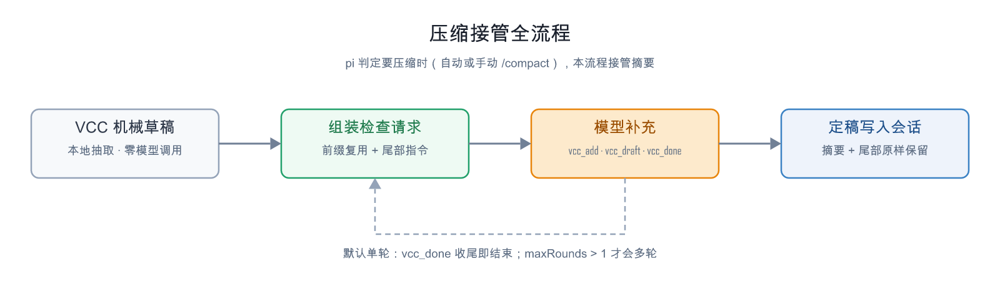
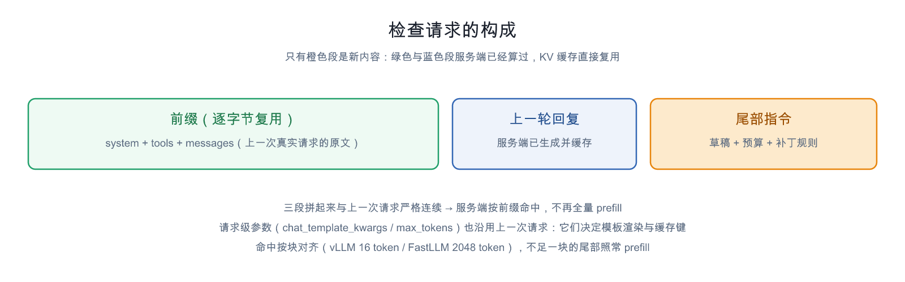
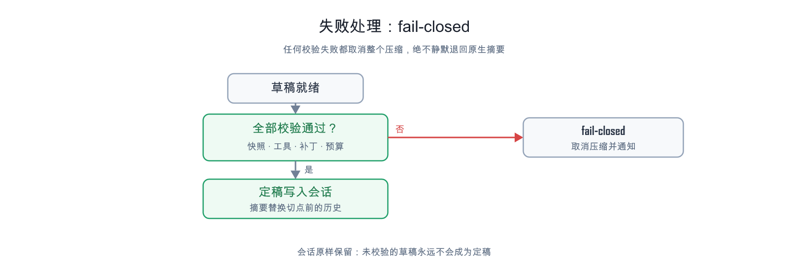

# pi-vcc-plus

> 把 pi 的上下文压缩从"另起一次摘要请求"改成 **VCC 机械草稿 + 模型就地打补丁**：
> 压缩时前文一个字节都不改，不新增独立摘要请求，KV 前缀缓存直接复用。
>
> [English](README.en.md)

## 为什么需要它

pi 的原生压缩是一个**独立的摘要请求**：换掉 system prompt、重排正文、去掉 tools——token 0 就变了，
上一次请求积累的全部前缀 KV 缓存作废，整个前缀要重新 prefill 一遍（会话越长越贵）。

pi-vcc-plus 换了一种产出摘要的方式：

1. **草稿由算法生成**——上游 [pi-vcc](https://github.com/sting8k/pi-vcc) 机械抽取：确定性、零模型调用、毫秒级；
2. **模型只做一次补充**——在当前会话尾部追加一条指令，模型用 `vcc_delete`（按行号删）/ `vcc_add`（按节名追加）补一次；这一次响应就是全部补充内容，应用后阶段立即结束；
3. **前缀一个字节不动**——检查请求 = 上一次真实请求的原文（system + tools + messages）+ 尾部指令，
   前缀逐字节相同 → 服务端 KV 缓存必然复用。

代价：压缩后重建上下文那一次 prefill 仍不可避免（这是任何压缩方式的共同成本）。

## 与上游 pi-vcc 的关系

本扩展基于 [@sting8k/pi-vcc](https://www.npmjs.com/package/@sting8k/pi-vcc)（MIT，锁定 v0.8.0，
git submodule `third_party/pi-vcc` @ `303e89d`）：

| | pi-vcc（上游） | pi-vcc-plus（本扩展） |
|---|---|---|
| 草稿生成 | 机械抽取算法（结构、预算锚、校准） | 复用上游，不复制不改写（直接读它的源码） |
| 模型参与 | 无（纯算法） | 一次补充轮：`vcc_delete` / `vcc_add`（`vcc_draft` 按需，`vcc_done` 可选） |
| 前缀稳定性 | 不处理 | 快照复用 + 字节级复核 + fail-closed |
| 历史检索 | `vcc_recall`（读原始 JSONL） | 默认注册（可关闭） |

加载器只读上游**发布出来的源码**，一行不改。更新上游：

```powershell
git submodule update --remote --merge third_party/pi-vcc
git add third_party/pi-vcc
git commit -m "bump pi-vcc"
```

（`scripts/setup-upstream-vcc.ps1` 只用于"重做这次切换"——把仓库里的本地副本换成 submodule。）

> 如果你另装了 pi-vcc 本体（`pi install npm:@sting8k/pi-vcc`），请在 `~/.pi/agent/settings.json`
> 里把它设为**安装但不加载**：`{ "source": "npm:@sting8k/pi-vcc", "extensions": [] }`。
> 否则它自己的 `session_before_compact` 钩子会和本扩展抢同一次压缩。

## 工作原理

### 压缩接管全流程



触发点复用 pi 原生：上下文将满自动触发，或手动 `/compact`（沿用 pi 自己的 abort 语义）。
接管发生在 `session_before_compact` 事件——拿到 pi 已算好的 preparation（切点、待摘要区间、预算）之后：

1. **VCC 机械草稿**：本地运行上游 pi-vcc 生成结构化草稿（零模型调用）；
2. **组装检查请求**：上一次 provider 请求的快照（system + tools + messages 原文）+ 尾部指令（草稿、预算、补丁规则）；
3. **一次补充轮**：模型在“压缩校验阶段”用封闭工具补一次——`vcc_delete` 按**行号**删行
   （草稿的章节区对模型是带行号的视图：`NNN | 行`；转录区不编号、只读），`vcc_add` 按**节名**把行追加到该节末尾
   （`replace:true` 先清空该节，即“整体重写该节”），每次调用的回执是一段**完整 diff**（删掉的行带行号）。
   这一次响应会被原样应用并结束该阶段（`vcc_done` 可选）；若这一轮完全没有工具调用，追加一句纠偏后再问一次
   （`guards.emptyRetries`）；若响应撞上 completion 上限，已解析出的调用照常应用（`round_truncated`）；
4. **定稿写入会话**：定稿前先过一道机械剥离（丢掉草稿末尾的逐轮转录、`---` 与 `vcc_recall` 提示，见下），
   再把定稿摘要返回给 pi、由 pi 写 `CompactionEntry`；保留的尾部原样进入下一个窗口。

### 检查请求的构成



- **messages**：`context` 事件在每次 provider 请求前触发，快照保存的是模型实际看到的 agent 格式消息
  （`images.blockImages` 开启时做与 pi `convertToLlmWithBlockImages` 相同的替换）；
- **上一轮回复**：检查请求在尾部指令之前再拼一条 assistant 消息（快照之后会话里新增的最后一条回复）。
  服务端刚刚生成过这条回复，KV 里就有——拼上它，检查请求才是上一次请求的**严格延续**（与正常轮次
  之间的关系完全一致），服务端才肯按前缀命中。没有它，token 流在快照结尾处就与 slot 里存的序列分叉；
- **tools**：只从 `before_provider_request` 的 payload 取（上一次请求自己的 wire tools，含顺序）；
  检查请求经自定义 fetch 发出，出站 body 的 `tools` 被替换为这份**原始 wire tools**——构造性字节一致
  （pi-ai 自己的重建永远不上 wire）；
- **请求级参数**：自定义 fetch 同时把上一次请求的请求级参数（`chat_template_kwargs`、`max_tokens`、
  `store`、采样参数……）写回出站 body。两个原因：① `chat_template_kwargs` 参与**服务端模板渲染**，
  `enable_thinking` 一变（agent 轮次为 true、`complete()` 检查请求默认 false），渲染出的 token 序列就不同，
  前缀再字节相同也命不中；② 部分服务端（实测 FastLLM）把 `max_tokens` 也算进前缀缓存键。
  `model` / `messages` / `tools` 由扩展自己掌控，永不被覆盖；
- **字节级复核**：第 1 轮把出站 body 与上一次真实请求的 wire body 做前缀比较（system / tools / messages），
  结果写 `checkPrefix` 日志（`identical` + `firstDivergence`），完整 body 写 `.pi/prefix-sentinel/check-request.json`。
  基线要求新鲜（`ts ≥ 快照时刻`），旧进程/其它会话的残留不会误报；
- **框架层断言**：`round.cacheRead ≈ 前缀长度`（`prefixSuspect` 必须为 false）——同一不变量的第二道防线。
  注意命中按**块**对齐（vLLM 16 token / FastLLM 2048 token），不足一块的尾部本来就要 prefill；

### 定稿摘要的格式（机械剥离）

上游 VCC 的草稿是给“人读”的产物：`[章节]` 块 + `---` + **逐轮转录**（`[user]` / `[assistant]` /
`* tool "…" (#123)`）+ `---` + `vcc_recall` 提示；它的 `mergePrevious`
（`preserveFreshBriefOnMerge`）还会把上一份草稿的转录合并进新草稿，于是转录跨压缩累积。
原样留下的话，下一个窗口打开就是“摘要 + 一堆像被追加的后几轮消息”，带着 `[user]`/`[assistant]`
标记与 `(#123)` 索引——而 pi 保留的尾部又紧跟在后面，看起来就是重复。

所以定稿前做一次机械剥离（`src/finalize.ts`，**不依赖模型配合**）：

- 丢掉所有转录块、`---` 分隔行、`vcc_recall` 提示与 `...(N earlier lines omitted)` 标记；
  提示词因此**不再要求模型逐行删除转录区**（那是 7K 字符的原文白烧输出 token，还容易因行号越界/指错而失败），
  只说"转录区自动剥离、只当原料"；预算上限也改成按**剥离后**的正文计（否则转录会把草稿顶过上限）；
- 章节名归一到固定 8 个并按固定顺序输出：`[Session Goal]`、`[Files And Changes]`、`[Commits]`、
  `[Key Decisions]`、`[Environment]`、`[Results]`、`[Outstanding Context]`、`[User Preferences]`；
  别名（`[Outstanding]`）改名，自造标题（`[Root Cause: …]`）按关键词并入最合适的章节（内容不丢）；
- 只动转录/分隔/提示行，**章节 bullet 永不丢弃**；同一节里的完全重复行去重；
- 若剥离后没有任何章节（草稿不是章节形状）则**不做剥离、原文返回**，绝不把摘要变成空串；
- 每次剥离写一行 `finalize` 日志：`strippedTranscriptLines` / `strippedSeparators` / `strippedNotes` /
  `renamed` / `folded` / `charsBefore`→`charsAfter`。

实测（本仓库会话 `01a0ca67` 那份摘要）：15798 → 8670 字符，剥掉 97 行转录、3 行 `---`、2 处提示、
1 处省略标记；`[Outstanding]`→`[Outstanding Context]`，`[Root Cause: 双重 prefill（本次核心）]`→并入 `[Results]`。

### 失败处理



| 触发 | 例子 |
|---|---|
| 快照缺失 | 全新会话还没发生过 provider 请求（`/reload` 后先尝试恢复持久化快照；仅全新会话需先发一条消息） |
| tools 不可用/不一致 | 拿不到 wire tools；wire tools 含 grammar/custom、`strict: true`、`defer_loading` |
| 补丁校验失败 | 行号越界/指向标题/指向转录区/重复删同一行；追加超出预算；连续失败超限 |
| 模型异常 | API 错误、中止、纯文本收尾但 `requireDone`、轮次/draft 读取上限 |

默认策略 `onFailure: auto`：手动 `/compact` → 抛错；自动压缩 → 取消 + 通知。
`fallbackToNative: false`——**绝不静默退回原生摘要**：静默回退会让"前缀复用"这个核心目标失效，而且用户无法察觉。

## 安装

```powershell
# 0) 安装依赖（submodule 里的 recall 工具 import typebox，从仓库根解析）
npm install        # lockfile 已提交；bun install 亦可（测试用 bun 跑）

# 1) 安装扩展本身（本地路径不会被复制，改代码后 /reload 即可生效）
git clone https://github.com/113636xfh/pi-vcc-plus.git
pi install ./pi-vcc-plus

# 2) 让 pi 能加载 VCC：三条路任选其一（见下）
```

`src/vcc.ts` 按以下顺序解析上游 pi-vcc（都用它**发布出来的源码**，我们不改它一行）：

1. `config.vccPackagePath`（显式指定）
2. 环境变量 `PI_VCC_PLUS_VCC_PATH`
3. **仓库内** `third_party/pi-vcc`（推荐：git submodule）
4. `~/.pi/agent/npm/node_modules/@sting8k/pi-vcc`（`pi install npm:@sting8k/pi-vcc` 装的位置）
5. `<cwd>/.pi/npm/node_modules/@sting8k/pi-vcc`

## 配置

`~/.pi/agent/vcc-plus/config.json`（首次运行自动生成）：

```json
{
  "enabled": true,
  "vccPackagePath": null,
  "checkModel": null,
  "draftBudget": { "floorTokens": 1100, "ceilingTokens": 2000, "tokensPerBlock": 15 },
  "guards": { "maxRounds": 8, "maxConsecutiveFails": 4, "maxDraftReads": 3, "callTimeoutMs": 0, "requireDone": false },
  "onFailure": "auto",
  "fallbackToNative": false,
  "upstreamRecallTool": true,
  "alignCheckParams": true,
  "onContextOverflow": "trim",
  "debugLog": true,
  "systemBlock": "<pi-vcc-plus>…</pi-vcc-plus>"
}
```

- `checkModel: null` = 检查请求跟随会话当前模型；
- `guards` 全部是**计数**：慢模型不会被时间掐断（`callTimeoutMs` 默认 0 = 不限）；
  `maxRounds: 1` = 单轮补充（带编辑的那一次响应即全部内容），设 >1 回到"多轮补丁直到 `vcc_done`"的形态；
  `emptyRetries: 1` = 某一轮完全没有工具调用时再问一次（否则会把未改动的机械草稿当成摘要落盘）；
  `requireDone: true` 时模型必须显式 `vcc_done`（否则纯文本收尾升级为失败）；
- `onFailure`：`auto`（手动抛错 / 自动 cancel+通知）、`cancel`、`throw`、`draft`（显式回退未校验草稿）；
- `fallbackToNative: false` = 失败时不静默退回 pi 原生摘要；
- `upstreamRecallTool: true` = 注册上游 pi-vcc 自带的只读 `vcc_recall`（校验阶段内被拒绝）；
- `alignCheckParams: true` = 检查请求沿用上一次真实请求的请求级参数（`chat_template_kwargs`、
  `max_tokens`……），使渲染与缓存键与上一次一致。**需要它的后端**：模板会在参数变化时重渲前缀
  （实测 FastLLM 的 GGUF 模板：`enable_thinking` 翻转 → 同一段历史差 36 token → `cached_tokens=0`），
  或把参数算进缓存键（实测 FastLLM：token 完全相同、只改 `max_tokens` → `cached_tokens=0`）。
  **代价**：检查轮继承会话的思考设置，每轮都会思考（实测单轮输出 4441 token、耗时 2m05s）。
  仅用「缓存键只由 prompt token 决定」的后端（实测 vLLM + LMCache：翻转 `enable_thinking` 只改尾部
  2 token，命中照旧）时可以关掉，检查轮不思考、快得多；改完用 `round.prefixSuspect`
  或 `node scripts/log-rounds.mjs` 复核；
- `onContextOverflow: "trim"` = 检查请求超出 provider 上下文窗口时的处置。**为何会有这种情况**：pi 0.87 的
  上下文估算写死 `chars/4`（`dist/core/compaction/compaction.js`），而中文为主的内容实际约 **2.2 字符/token**——
  实测同一会话 pi 估 **178,397**、服务端算出 **322,385**（**1.81×**），于是 pi 压缩触发太晚、真实请求先被
  provider 400（llama.cpp：`request (322385 tokens) exceeds the available context size (262144 tokens)`）。
  `trim`（默认）= 用 provider 给的真实数字反推 chars/token，保留能装下的最新一段（旧的那段本来就在草稿里）
  重试一次；重试仍超窗则用**机械草稿**定稿（否则这个会话就彻底压不动了）；`draft` = 不重试，直接走草稿定稿
  （最快，适合 provider 慢/挂着）；`fail` = 不做特殊处置，按 `onFailure` fail-closed。
  前提说明：会话本身超窗时，上一次请求已被拒，服务端本来就没有可复用前缀，所以「只 prefill 一次」在此场景不适用；
  两种降级都写 `check_trimmed` / `overflow_fallback` 日志 + UI 警告（非静默）；
- 配置只在扩展加载时读一次；改 `config.json` 需 `/reload`（中途改会改变系统块、破坏前缀不变量）；
- 草稿的 chars/token 校准沿用上游 `before-compact.ts` 的锚（span 字符 + 上次摘要字符 ÷ `tokensBefore`）：
  这是上游算法的行为（对估算偏保守），我们刻意保持一致、不单方分叉。

## 与原生压缩的对比（实测）

设备与口径：e5 本地 llama.cpp（Qwen3.8-27B-GSQ-RCO-IQ3_S-mtp，`-c 350208 --parallel 2 --kv-unified`，
q8_0 KV，MTP draft n=3）。样本是一段**真实的编码会话**（有效上下文 ~180K token，内含 48 条带工具调用的消息），
两种实现跑**同一份会话副本**，串行、服务端空闲。

| 压缩一次（~180K 上下文） | pi 原生 | **pi-vcc-plus** |
|---|---|---|
| 压缩耗时 | 508 s | **196 s（快 2.6 倍）** |
| 其中 prefill | 112,166 token → 244.0 s | **3,584 token → 15.9 s**（`cacheRead` 命中 184,940，即上下文的 98%） |
| 其中生成 | 8,836 token → 181.8 s | 6,494 token → 178.9 s |
| 摘要规模 | 30,886 字符 | 9,774 字符 |
| 压缩后加载新上下文 | 44.3 s | 28.4 s |

原生的摘要请求必须换 system prompt、重排正文、去掉 tools——token 0 就不同，于是**整个前缀作废**：
实测它每次都重新 prefill **112,166** 个 token。pi-vcc-plus 的检查请求是上一次请求的严格延续，
前缀逐字节相同，服务端直接复用，只需 prefill 草稿与尾部指令那几个 token。
生成侧两者相当（真实会话里机械草稿已经完整，模型只做少量增删——这正是它省时间的另一半原因）。

⚠️ **一个例外：冷启动**（`/reload` 后、或刚恢复一个会话）时服务端没有该会话的 KV，检查请求只能从会话
重建，会比原生多发一段原文（实测 194,836 token vs 原生的 127,838）——这种情形下 VCC 反而更贵。
正常使用中压缩发生在热会话里，不属此列。

口径与原始数据（逐样本、prefill 速率分布、思考量拆分、提示词版本对比、冷启动对照）：
[`docs/vcc-vs-native-notes.md`](docs/vcc-vs-native-notes.md)。

## 测试

```powershell
bun run typecheck                            # tsc --noEmit（strict）
bun test test/                              # 编辑规则单测 + 校验循环回归 + recall 加载
bun run test/draft-smoke.ts <session.jsonl>  # 用真实会话离线生成草稿（不调模型）
node scripts/e2e-rpc-compact-test.mjs        # RPC E2E：种子短会话 → 三轮 → /compact
node scripts/e2e-rpc-compact-resume.mjs      # 恢复压缩后的会话 → 提问 → 第二次 /compact
node scripts/log-rounds.mjs [sessionId]      # 读会话日志，打出每轮 cacheRead / prefixSuspect 验收表
```

> `bun run typecheck` 需要 devDependencies（`typescript`、`@earendil-works/pi-coding-agent@0.87.0` 等）：
> `npm install` 或 `bun install` 装一次即可。
> 仓库路径含 `&`，Windows 下 `.bin` shim 会解析失败——直接
> `node node_modules/typescript/lib/tsc.js -p tsconfig.json`。
> 另备 `tsconfig.check-087.json` 对 0.87.0 类型做同法检查。

## 目录结构

```
index.ts                 pi 扩展入口（系统提示词块 + 四个工具 + 快照 + 压缩接管）
src/
  config.ts              配置与系统提示词块（英文常量）
  prompt.ts              尾部指令 / diff 回执 / 错误文案（英文）
  patch.ts               补丁应用与校验（纯逻辑，有单测）
  engine.ts              快照 / 草稿 / 校验循环 / fail-closed
  vcc.ts                 加载上游 pi-vcc（不复制、不改写）
  log.ts                 ~/.pi/agent/vcc-plus/log/<sessionId>.jsonl
test/                    单测、回归与 recall 加载
docs/
  design.md              详细设计（不变量、决策表、模型可见文本）
  vcc-vs-native-notes.md 实测对比
  src/*.svg              插图源码（手工布局，可编辑）
  images/*.png           渲染产物（已提交，GitHub 可直接引用）
  render.mjs / verify.mjs / probe-pixels.mjs   渲染与验证脚本
scripts/                 E2E 与 maintainer 脚本
third_party/pi-vcc/      上游 pi-vcc（git submodule，锁定版本）
```

## 日志与验收

`~/.pi/agent/vcc-plus/log/<sessionId>.jsonl`：`vcc_loaded`、`draft`、`checkPrefix`、
`round`（含 `cacheRead`、`expectedPrefixTokens`、`prefixSuspect`、`toolsSource`）、
`tool`、`summary_final`、`snapshot_restored`、`snapshot_rebuilt`、`finalize`、`fail_closed`。

**首次实测要看的一条**：`round.prefixSuspect` 必须为 false（即 `cacheRead ≈ 前缀长度`），
否则说明前文被改动了，前缀复用没有成立。

## 已知限制

- **冷启动**：快照只在扩展观察到新 provider 请求之后建立。`/reload`（或新进程、或从未有过请求的项目）后 `/compact`
  按三级降级：① 内存快照 → ② 同会话的持久化快照（`同会话 + 完整 + round-trip 通过`）→
  ③ **从会话本身重建**（消息取 pi 的 session projection，system 取 `ctx.getSystemPrompt()`，
  tools 取 `pi.getAllTools()` 里的活跃工具），日志记 `snapshot_rebuilt`。重建缺的只有 wire 才能知道的东西——
  wire tools 的逐字节形状/顺序与请求级参数（`chat_template_kwargs`、`max_tokens`……）——但 pi-ai 自己序列化
  tools 与真实请求一致，所以检查请求仍然可用；若真的分叉了，round 1 的 `prefixSuspect` 与哨兵都会报出来（非静默）。
  只有三种情况才 fail-closed：会话为空、pi 没暴露 session projection、或拿不到任何 tools（没有 tools 模型就无法打补丁；
  请先发一条普通消息再 `/compact`）；
- 检查请求由扩展直接用 `ModelRegistry.complete` 发出（不走 Agent 流式路径），
  `before_provider_request` 等钩子对它不触发——所以它的字节一致性由扩展自己的
  fetch 拦截验证（B 面）；钩子层的观测插件对它不可见（wire 层的全局 fetch 包装仍可见）；
- 若其它扩展注入 mid-conversation system 消息且模型支持缓存，检查请求前缀会从该消息起分叉——
  `firstDivergence` 记录可见（非静默）；
- token 估算基于字符数启发式（沿用上游算法），偏保守。

## License

MIT — 见 [LICENSE](LICENSE)
